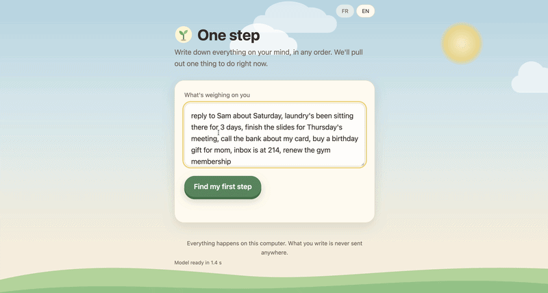
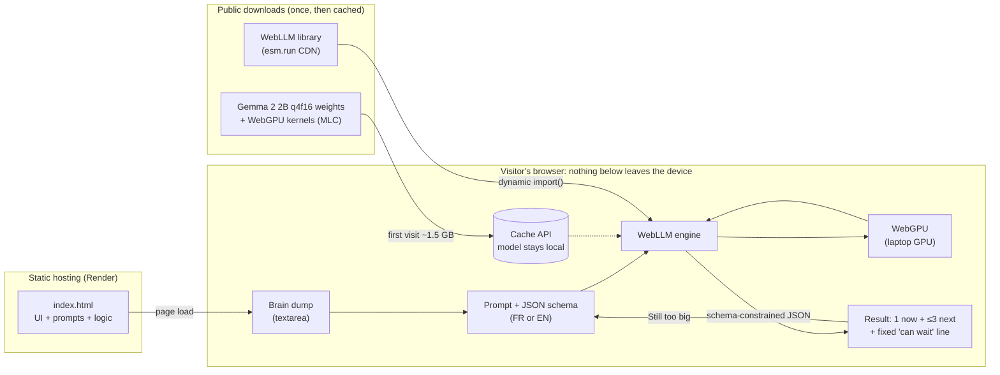

<div align="center">

# 🌱 One step · Un pas

**When everything feels urgent, get just one next step.**
Dump everything on your mind. An open-weight model running **entirely in your browser** picks one thing to do right now.

[](https://hacktoberfest.com)
[](https://dev.to/mialy333/when-everything-feels-urgent-i-built-my-sister-a-tool-that-gives-her-just-one-next-step-3hg7)

[](https://ai.google.dev/gemma)
[](https://github.com/mlc-ai/web-llm)
[](https://developer.mozilla.org/docs/Web/API/WebGPU_API)
[](#-privacy-by-architecture)
[](LICENSE)

[**Live demo**](https://one-step-jypm.onrender.com) · [**Read the story on DEV**](https://dev.to/mialy333/when-everything-feels-urgent-i-built-my-sister-a-tool-that-gives-her-just-one-next-step-3hg7)



</div>

> [!NOTE]
> Built for the **Hacktoberfest 2026 DEV Weekend Challenge: _Build for a Friend_** (MLH × DEV), whose prompt is to build something with open-source AI at its core. I built it in one evening for my sister, and she used it the same night.

---

## 💡 Why

When everything feels equally loud, it's easy to pick nothing, or to pick whatever feels most *urgent* instead of what's *important*. One step turns a messy brain dump into:

- **one** action to do right now, small enough to start in under 10 minutes;
- at most **three** next actions, with deadlines first;
- one fixed line: *"Everything else can wait."*

If the action still feels too big, **"Still too big"** breaks it into an even smaller first step.

No accounts, no streaks, no reminders, no red badges.

## 🏗️ Architecture

One static HTML file. No framework, no build step, no backend. The model runs on the visitor's own GPU.



### Request flow

1. **Load.** The page renders its text first, *then* dynamically imports WebLLM, so a slow CDN never blanks the page.
2. **Model.** On the first visit, the weights download once (about 1.5 GB) into the browser's Cache API. Later visits load from the cache.
3. **Plan.** The brain dump and a strict prompt go to Gemma with a JSON schema (`maintenant`, `ensuite`). WebLLM's grammar engine forces the output into that exact shape.
4. **Guardrails in code, not in the model.** The UI caps "next" at 3 items, removes duplicates, and renders *"Everything else can wait"* as fixed text.
5. **Still too big.** A second, smaller prompt returns one 2-minute first step, with its own schema (`etape`).

## 🔒 Privacy by architecture

| Downloaded by the browser | Never leaves the device |
|---|---|
| `index.html` (from Render) | Everything you type |
| WebLLM library (from the CDN) | The model's answers |
| Model weights and kernels (once, then cached) | Your tasks, your history |

There is no server-side code, no analytics, no external fonts, and no API key. Once cached, the model works offline.

## 🧰 Tech stack

| Layer | Choice | Why |
|---|---|---|
| Model | **Gemma 2 2B** (`gemma-2-2b-it-q4f16_1-MLC`) | Officially prebuilt for WebLLM; about half the download of Gemma 4 E2B |
| Inference | **WebLLM** on **WebGPU** | Runs on the user's GPU: no install, no server |
| Structured output | JSON mode with a schema passed as a string | The UI always gets the same shape |
| UI | Vanilla HTML / CSS / JS, FR/EN toggle | One file, nothing to build |
| Hosting | Render static site | Free, deploys on every push |

## 📊 Measured performance

| | Author's laptop | Sister's laptop |
|---|---|---|
| Model ready | not measured | 20.4 s |
| Time per answer | 0.9 to 1.5 s | 4.5 s for the first, then 0.9 to 1.1 s |
| Decode speed | 66 to 75 tokens/s | 30 to 38 tokens/s |

Add `?debug` to the URL to see these numbers live.

## 🚀 Run it locally

```bash
git clone https://github.com/Mialy333/one-step.git
cd one-step
python3 -m http.server 8000
# open http://localhost:8000/?lang=en&debug in Chrome or Edge
```

A local server is required, because WebGPU and the Cache API don't work from `file://`.

**URL options:** `?lang=fr` or `?lang=en` forces the language; `?debug` shows load time and tokens/s.

## 📁 Project structure

```
one-step/
├── index.html     # the whole app: UI, FR/EN copy, prompts, schemas, WebLLM calls
├── assets/
│   └── demo.gif   # demo for this README
├── README.md
└── LICENSE        # MIT
```

## 🧠 Lessons learned

- **Small model, smaller job.** Asking a 2B model for three lists produced invented tasks and contradictions. Removing the third list, and making it fixed UI text, fixed most of it.
- **Pass the JSON schema as a string.** Otherwise WebLLM fails with `Cannot pass non-string to std::string`.
- **Few-shot examples leak.** The model copied a task from the example into a real answer. The example now shares nothing with real lists.
- **Never block the UI on a CDN import.** Load the copy first, then `import()` the engine.

The full write-up, including everything that broke, is in the [DEV post](https://dev.to/mialy333/when-everything-feels-urgent-i-built-my-sister-a-tool-that-gives-her-just-one-next-step-3hg7).

## 🗺️ Roadmap

My sister asked for these the same night:

- [ ] Tick the current step and move to the next one
- [ ] See what's already done today
- [ ] Add tasks, and reveal the ones hidden behind "Everything else can wait"
- [ ] Keep all of it local (browser storage), with nothing sent anywhere

## ⚠️ Limitations

- Requires **Chrome or Edge on a computer**: WebGPU with fp16 shader support. Mobile isn't supported.
- First load downloads about 1.5 GB.
- Nothing is saved between visits yet.

## 📄 License

[MIT](LICENSE) © 2026 Mialy Ratsimbazafy

Built with open weights ([Gemma](https://ai.google.dev/gemma)) and open source ([WebLLM / MLC](https://github.com/mlc-ai/web-llm)) for **Hacktoberfest 2026**.
